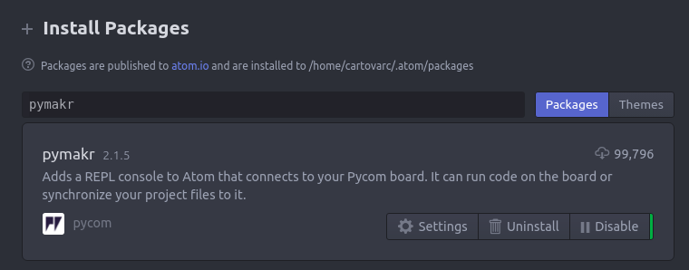
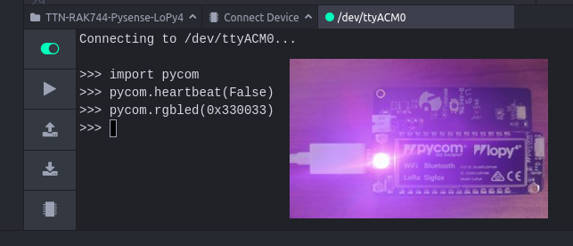

# TheThingsNetwork + RAK744 + Pysense + LoPy4

### In this lab we will learn how:
- Configure RAK744 gateway and connect it to TheThingsNetwork.
- Get accelerometer, temperature, pressure, humidity and light data from Pysense board.
- Send Pysense data to internet using LoPy4 and TheThingsNetwork.
- Visualize Pysense data in realtime on a simple webpage.

### Used components
- [RAK744 Gateway](https://doc.rakwireless.com/rak7244-lorawan-developer-gateway)
- [Pysense](https://docs.pycom.io/datasheets/expansionboards/pysense)
- [LoPy4](https://docs.pycom.io/datasheets/development/lopy4)
- [Pysense + LoPy4 case](https://www.thingiverse.com/thing:3466386)
- LoRa antenna 915MHz with IPEX to SMA connector
- 3.7V lithium battery with JST connector
- Micro USB cable

## Configure development environment

### Serial permissions
Add yourself to the dialout group. You will have to logout and then log back in before the group change is recognized.

```bash
sudo adduser $USER dialout
```

### Install Atom
- https://atom.io/

### Instal PyMkr plugin on Atom
- Click on Edit > Preferences > Install
- In install packages find "pymakr" and install it.



### First Script on LoPy4 + Pysense
- Connect LoPy4 to Pysense board, and plug it to your computer with micro USB cable as image above:
  

- You will see ">>>" in your Pymakr terminal
  

- Write in terminal a script that turn on led with an custom color
  

- LoPy4 rgb led will turn on
  
